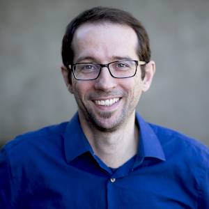

# Continuous Integration With Jenkins

## 2022-04-27 7:00pm

_Duration: 1 hour_

- [Add To Google Calendar](https://calendar.google.com/calendar/render?action=TEMPLATE&dates=20220428T020000Z%2F20220428T030000Z&details=In%20this%20session%2C%20you%27ll%20learn%20about%20Jenkins%2C%20one%20of%20the%20most%20popular%20continuous%20integration%20tools.%20We%27ll%20talk%20about%20configuration%20as%20code%20and%20try%20to%20provide%20attendees%20with%20the%20opportunity%20to%20play%20around%20with%20the%20system.&location=http%3A%2F%2Flovelace-labs.adadev.org&text=Jenkins%20and%20Continuous%20Integration%20with%20Jason%20Lantz%20and%20Kevin%20Burnett)
- [Add to Microsoft Calendar](https://outlook.live.com/calendar/0/deeplink/compose?allday=false&body=In%20this%20session%2C%20you%27ll%20learn%20about%20Jenkins%2C%20one%20of%20the%20most%20popular%20continuous%20integration%20tools.%20We%27ll%20talk%20about%20configuration%20as%20code%20and%20try%20to%20provide%20attendees%20with%20the%20opportunity%20to%20play%20around%20with%20the%20system.&enddt=2022-04-28T03%3A00%3A00%2B00%3A00&location=http%3A%2F%2Flovelace-labs.adadev.org&path=%2Fcalendar%2Faction%2Fcompose&rru=addevent&startdt=2022-04-28T02%3A00%3A00%2B00%3A00&subject=Jenkins%20and%20Continuous%20Integration%20with%20Jason%20Lantz%20and%20Kevin%20Burnett)

Come and learn about Jenkins, one of the most popular continuous integration tools. We'll talk about configuration as code and try to provide attendees with the opportunity to play around with the system.

## Jason Lantz & Kevin Burnett

_Image: Kevin Burnett_

Jason Lantz and Kevin Burnett have been doing DevOps stuff for several years, collaborating with colleagues across many disciplines, and relaxing with code.
