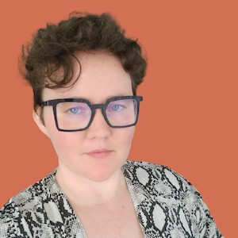

# Digital Accessibility for Developers

## 2022-05-27 at 5:45pm

_Duration: 1 hour_

**Topics:** Disabilities and Standards, HTML5 as A11y, Images, Design and Color, Multimedia and Motion, Forms, Using ARIA

Students will gain an introduction to Digital Accessibility, disability in the digital context, and the WCAG standards that govern what is and what is not considered accessible code.

We will then go deeper and ask, “How do we as developers make products with accessibility in mind?” We’ll cover a number of topics including HTML5, Images, Forms and more. We’ll talk high level, with examples, then dive into the code.

We’ll conclude with resources for how developers can specialize in this growing and rewarding Software Engineering niche.

## Lē Silveus McNamara

Lē, pronounced “Lee”, (they/them) brings a diverse background and skillset to Digital Accessibility. An alumna the [Grace Hopper coding academy](https://www.gracehopper.com/) in NY, Lē discovered their passion for accessibility in 2018 after a career transition from Public Relations and community work to Software Engineering.

Their most recent roles include Accessibility Engineer at TPGi (current), Accessibility Remediation Engineer with Smartsheet.com and Principal Accessibility Developer and Founder of Larunda Accessibility Solutions. Lē is passionate about accessibility, for the neurodivergent in particular, and identifies as a member of the neurodivergent community.
