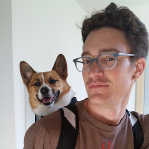

# Introduction to custom dockerfiles

## TBD

_Duration: 2 hours_

This session should provide an introduction to the most common and useful Dockerfile syntax and tools.

Topics will include:

- The basic Dockerfile directives FROM, COPY, ADD, RUN, WORKDIR, EXPOSE, USER, LABEL, ARG, ENV
- Using image repos
- ENTRYPOINT vs CMD
- Managing layers
- Named and Multistage Builds
- Common deployment scenarios

The goal will be to demonstrate the use of the above using scenarios that I encounter on a regular basis. The format of the session will be lab-style, where students will be able to run the builds themselves and examine the output. The ultimate goal will be to show some good patterns and best practices for producing better custom dockerfiles.

## Sierra Soleil

I work as a DevOps Engineer for Crystal Dynamics, a video game studio. I specialize in building and maintaining kubernetes-based services used by both players and internal developers.
