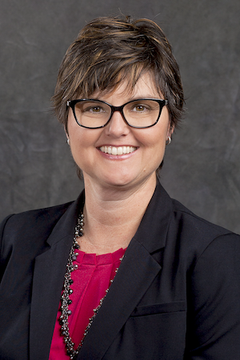

# Put Your Retirement To Work

## 2022-03-09 at 5:30pm

Retirement can mean different things to different people. Maybe you want to travel, volunteer, start your own business or go back to school.

Whatever you decide, you need to be financially prepared. Taking advantage of your employer-sponsored retirement plan is one way to help prepare for whatever kind of retirement you have ahead.

We’ll discuss:

- The importance of saving for retirement
- How to save through your employer-sponsored plan
- Other tax-advantaged options for building your
  retirement savings

[Flyer](https://drive.google.com/file/d/1nSDO7b2B_U3Maz78YSLwy0wEUL1NC6r6/view?usp=sharing)

## Kim Stirling

[Profile](https://www.edwardjones.com/us-en/financial-advisor/kim-stirling)

Do you aspire to be a better version of yourself? Have you been successful in other areas of your life, but feel unsure or overwhelmed when it comes to financial matters? Are you wondering if the things you have worked so hard for will provide the type of lifestyle you want for you and your family, now and into the future? If so, keep reading – I have something I'd like to share with you.

I grew up in Baton Rouge, Louisiana where the cicadas sing as loud as your taste buds do after eating some spicy Cajun food. My parents were too busy working to give any guidance on money matters. Purely by accident, I started investing at 21 but my financial advisor taught me nothing and I withdrew my assets, not understanding the power of compounding interest. I also did not understand my 401(k) and lost out on unvested dollars. Now I have a passion for teaching how to avoid financial mistakes.

I serve individual investors, multi-generational families and business owners who see the importance of planning for the future and are seeking to be an engaging partner in the process. You are the captain of your own financial ship. Whatever voyage you are on, you can think of me as your navigator or radar person keeping you pointed in the right direction. When we partner together, we can smooth out the ride to your destination.

Working with me is my branch office administrator, Cheryln Morrell. She has been with Edward Jones since 2011 and brings a wealth of knowledge and a fierce passion for helping others. Cheryln has an eye for detail and is a warm and friendly advocate for our clients. She enjoys soccer, horses and spending time with family.

My hobbies include hiking, paddle boarding, photography, adventure sports, flying, boating and going on road trips with my dogs. I am a member of America's Boating Club and volunteer with Kitsap Humane Society. I live in Bremerton with my two dogs, Tux and Sophie.
