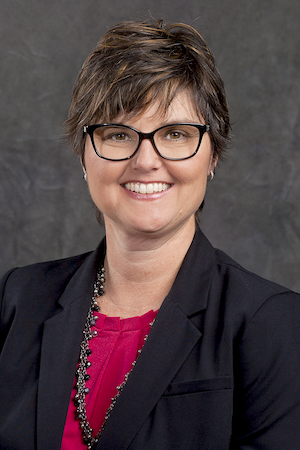

# Simplify Your Spending

## 2022-03-23 at 5:00 pm

Simplify Your Spending and Saving Strategies presentation
can help you bring balance to your budget.

You’ll learn more about:

- Setting personal financial goals
- Balancing saving, spending and borrowing to help
  achieve your goals
- Strategies for controlling debt and improving credit
  scores
- Practical savings options for now through retirement

[Flyer](https://drive.google.com/file/d/1oV7sda3jH1B3BNHgheY0FDaPcN2bsn-a/view?usp=sharing)

## Kim Stirling

Kim Stirling is a Financial Advisor at Edward Jones and regularly works to help people achieve their financial goals.
